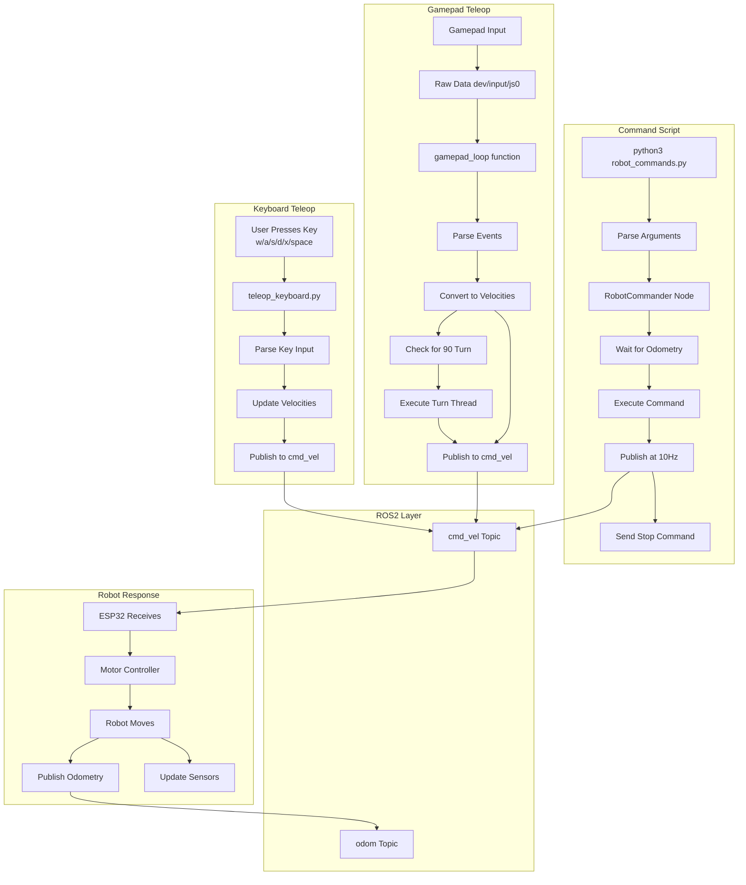

```mermaid
graph TD
    subgraph Keyboard["Keyboard Teleop"]
        K1[User Presses Key<br/>w/a/s/d/x/space]
        K2[teleop_keyboard.py]
        K3[Parse Key Input]
        K4[Update Velocities]
        K5[Publish to cmd_vel]
    end
    
    subgraph Gamepad["Gamepad Teleop"]
        G1[Gamepad Input]
        G2[Raw Data dev/input/js0]
        G3[gamepad_loop function]
        G4[Parse Events]
        G5[Convert to Velocities]
        G6[Publish to cmd_vel]
        G7[Check for 90 Turn]
        G8[Execute Turn Thread]
    end
    
    subgraph Commands["Command Script"]
        C1[python3 robot_commands.py]
        C2[Parse Arguments]
        C3[RobotCommander Node]
        C4[Wait for Odometry]
        C5[Execute Command]
        C6[Publish at 10Hz]
        C7[Send Stop Command]
    end
    
    subgraph ROS["ROS2 Layer"]
        RT[cmd_vel Topic]
        ODOM[odom Topic]
    end
    
    subgraph Robot["Robot Response"]
        R1[ESP32 Receives]
        R2[Motor Controller]
        R3[Robot Moves]
        R4[Publish Odometry]
        R5[Update Sensors]
    end
    
    K1 --> K2
    K2 --> K3
    K3 --> K4
    K4 --> K5
    
    G1 --> G2
    G2 --> G3
    G3 --> G4
    G4 --> G5
    G5 --> G7
    G7 --> G8
    G8 --> G6
    G5 --> G6
    
    C1 --> C2
    C2 --> C3
    C3 --> C4
    C4 --> C5
    C5 --> C6
    C6 --> C7
    
    K5 --> RT
    G6 --> RT
    C6 --> RT
    
    RT --> R1
    R1 --> R2
    R2 --> R3
    R3 --> R4
    R4 --> ODOM
    R3 --> R5
```
