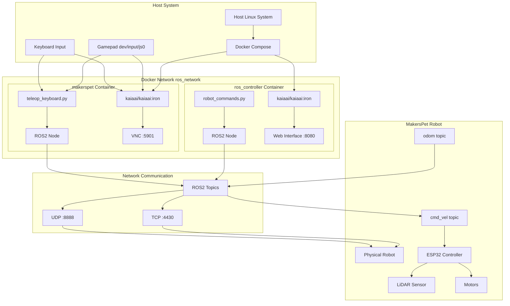

```mermaid
graph TB
    subgraph Host["Host System"]
        H[Host Linux System]
        KB[Keyboard Input]
        GP[Gamepad dev/input/js0]
        DC[Docker Compose]
    end
    
    subgraph DockerNet["Docker Network ros_network"]
        subgraph MakerspetContainer["makerspet Container"]
            MP[kaiaai/kaiaai:iron]
            TK[teleop_keyboard.py]
            ROS1[ROS2 Node]
            VNC[VNC :5901]
        end
        
        subgraph ControllerContainer["ros_controller Container"]
            RC[kaiaai/kaiaai:iron]
            CMD[robot_commands.py]
            ROS2[ROS2 Node]
            WEB[Web Interface :8080]
        end
    end
    
    subgraph NetComm["Network Communication"]
        RT[ROS2 Topics]
        UDP[UDP :8888]
        TCP[TCP :4430]
    end
    
    subgraph Robot["MakersPet Robot"]
        ROB[Physical Robot]
        ESP[ESP32 Controller]
        LID[LiDAR Sensor]
        MOT[Motors]
        RCMD[cmd_vel topic]
        RODOM[odom topic]
    end
    
    H --> DC
    KB --> MP
    GP --> MP
    DC --> MP
    DC --> RC
    
    KB --> TK
    GP --> TK
    TK --> ROS1
    CMD --> ROS2
    
    ROS1 --> RT
    ROS2 --> RT
    RT --> UDP
    RT --> TCP
    MP --> VNC
    RC --> WEB
    
    UDP --> ROB
    TCP --> ROB
    RT --> RCMD
    RODOM --> RT
    RCMD --> ESP
    ESP --> MOT
    ESP --> LID
```
